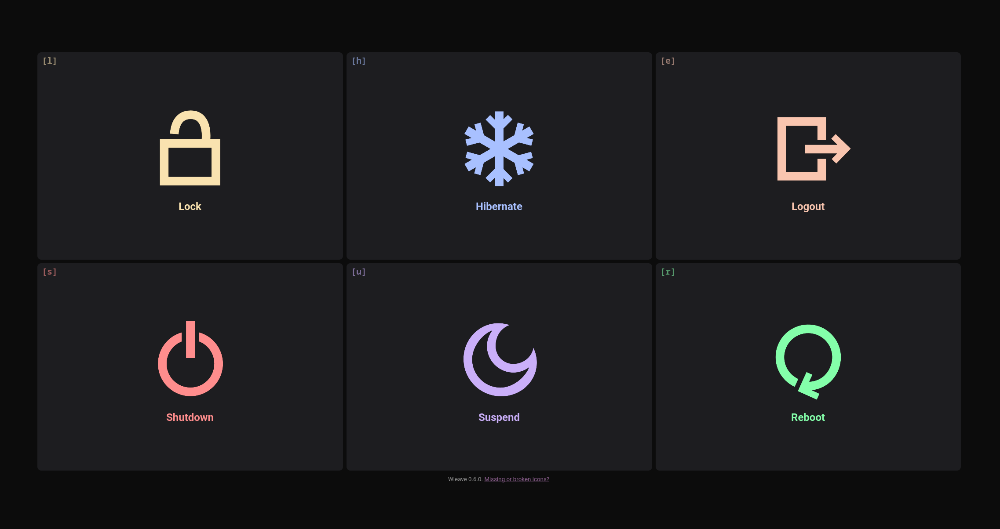

# wleave


A Wayland layer-shell logout prompt, now ported to GTK4!

Basically a fork of [wlogout](https://github.com/ArtsyMacaw/wlogout), rewritten in Rust.

**wleave** is backwards-compatible with **wlogout** configuration files.



## Installation

### Arch Linux

**wleave** can be installed from the **AUR**:

```shell
paru -S wleave-git
```

### Building from sources

Dependencies:

- gtk4-layer-shell
- gtk4
- a stable version of the Rust toolchain

You can run the application using `cargo run --release` or GNU make:

```shell
make
./target/release/wleave
```

## Usage

The command line options are backwards-compatible with **wlogout**.
See `--help` for a list of options.

## Help, how do I close the menu

The `<Esc>` key closes the menu, an option to change this may be added eventually.

## Keybinds reference

See <https://gitlab.gnome.org/GNOME/gtk/-/blob/gtk-3-24/gdk/keynames.txt> for a list of valid keybinds.

## Enhancements

- Natively GTK4 since version 0.5
- New pretty icons by [@earth-walker](https://github.com/earth-walker)
- Autoclose when window focus is lost (the `-f/--close-on-lost-focus` flag)
- Mnemonic labels (the `-k/--show-keybinds` flag)
- Pretty gaps by default
- Less error-prone
- Keybinds accept modifier keys and Unicode characters
- Easier to extend
